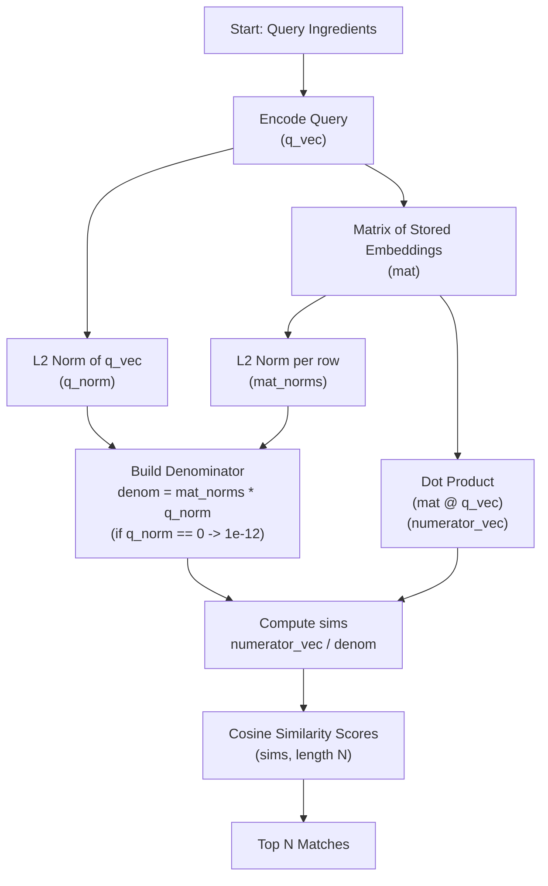

## Retrieval-Augmented Generation (RAG)

When I first heard about RAG (Retrieval-Augmented Generation) in the context of large language models (LLMs), I expected it to be a complex and technical concept. Even after doing a bit of reading and discovering that the information is generally stored as embeddings in a vector database, it seemed there’d be a fair amount of complexity involved. But eventually I realized that RAG is really a very straightforward idea: you just add (or augment) the prompt to the LLM with information that’s relevant to the question being asked.

It’s as simple as supplying the prompt with the information required to answer the question, then using the power of the LLM to generate a human response that isn’t just a regurgitation of the supplied information, but a synthesis of the information that’s relevant to the question.

For the past 7 blog posts (starting with [Experiments in Supervised Learning](/posts/2025-06-13-experiments-in-supervised-learning), we’ve been using the recipes from the [Recipe Folder](https://web.archive.org/web/20220630230600/http://recipe-folder.com/) database to experiment with various aspects of machine learning. We’re going to do the same here, but this time use an LLM to help create a recipe-suggestion system. The idea is that the user provides a list of ingredients they have on hand, and the LLM suggests a recipe that can be made with those ingredients. The LLM uses RAG to augment the prompt with recipes from the Recipe Folder database based on the ingredients provided by the user.

Imagine typing in a handful of ingredients—say, carrots, edamame, corn, and pork—and instantly getting a recipe suggestion that actually makes sense. That’s the promise of RAG applied to cooking, and it’s surprisingly straightforward once you see it in action.

### Trying It Out in a Notebook

Let’s use a Jupyter notebook to explore this idea. First, let’s switch to the rag branch of the repository.

If you haven't checked out the project yet, checkout the project from github: 

```bash
$ git clone git@github.com:kriserickson/recipe-parser.git
```

Then switch to the rag branch (if you have been working on the project already stash or save any work you have done in a seperate branch):

```bash
$ git checkout rag
```

now install the requirements for this blog post (if you have already been working on the project you probably want to do this anyway since the requirements for this project are different from the requirements for the rag branch).

```bash
source ./.venv/bin/activate # Linux/MacOS
# or ./.venv/Scripts/activate if you are on Windows
pip install -r requirements.txt
```

Now we can look at the notebook that we’ll be using to explore this idea.  Open the `notebooks/rag.ipynb` file in Jupyter notebook.  You have to run the first cell, but it just imports the required libraries and sets up some paths—we don’t really need to include it here, except the final line:

```python
# Load a small pre-trained embedding model (open local model)
model = SentenceTransformer('all-MiniLM-L6-v2')  # open-source embedding model
```

This loads the SentenceTransformer model that we’ll use to create the embeddings for the recipes. The model is downloaded from the internet the first time it’s run, so the first time it’s loaded, it’ll take a little time.

```python
# Ensure the labels directory exists
if not labels_dir.exists():
    print(f"Directory {labels_dir} does not exist. Please create it and add JSON files.")
    exit(1)
```

### SentenceTransformers

Next, we load the JSON files that contain the recipes. We’ll use the `SentenceTransformer` model to create embeddings for each recipe, and store the embeddings in a database that we’ll use to create the recipe-suggestion system. We use the ipywidgets library to display a progress bar while we’re loading the recipes and creating the embeddings.

```python
# Collect JSON files
files = sorted([p for p in labels_dir.iterdir() if p.is_file() and p.suffix == '.json'])

progress = widgets.IntProgress(value=0, min=0, max=len(files), description='Progress:')
pct = widgets.HTML(value="0%")
display(widgets.HBox([progress, pct]))
embedding_db = []  # list to store {"id", "name", "vector"} for each recipe
for idx, fp in enumerate(files):
    try:
        text = fp.read_text(encoding='utf-8')
        obj = json.loads(text)   
    except Exception as e:
        # Log and continue on parse/read errors
        print(f'Skipping {fp.name}: {e}')
        continue

    progress.value = idx + 1
    pct.value = f"{int(100 * (idx + 1) / len(files))}%"

    # add source filename so downstream steps know which file produced this record
    if isinstance(obj, dict) and obj.get("title") and obj.get("ingredients"):
        title = obj["title"]
        ingr = ", ".join(obj["ingredients"])  # safe join; ingredients is a list[str]
        text = f"{title}: {ingr}"
        vector = model.encode(text)            # get embedding vector (e.g., numpy array)
        embedding_db.append({
            "title" : obj["title"],
            "ingredients": obj["ingredients"],
            "source_file": fp.name,
            "vector": vector
        })
        
progress.value = len(files)
pct.value = "100%"

pickle.dump(embedding_db, open(model_path, 'wb'))
print(f"Stored {len(embedding_db)} recipe embeddings in the database.")
```

SentenceTransformer is a powerful library for creating embeddings from text. It’s a wrapper around the Hugging Face Transformers and PyTorch libraries, and it’s straightforward to use, providing a variety of pre-trained models (encoders) for generating embeddings. In the most basic terms, it converts the text of a string (in our case, the title and ingredients of a recipe) into a vector that can be used to compare the similarity of two strings. Depending on which model you select, you’ll get different features of the sentence encoded, with MiniLM being a good balance of features and size.

It gets its performance and small size from [attention distillation](https://sh-tsang.medium.com/brief-review-minilm-deep-self-attention-distillation-for-task-agnostic-compression-of-0be4516d6922). The particular MiniLM we chose (all-MiniLM-L6-v2) is a 6-layer Transformer with an embedding dimension of 384. Given that a whole book could probably be written about various Transformer models and MiniLM’s [advancements in particular](https://arxiv.org/abs/2002.10957), we’ll leave it at the fact that SentenceTransformer is a powerful tool to extract semantic meaning from text that can be stored in an embedding database. (Here we use an in-memory database, but in future posts we’ll use a vector database like [Chroma](https://github.com/chroma-core/chroma) or [Faiss](https://github.com/facebookresearch/faiss) to store the embeddings.)

The SentenceTransformer is much more sophisticated than the TF‑IDF (TfidfVectorizer) we used in the unsupervised learning blog post. When we encoded ingredients with TF‑IDF, we lost any semantic meaning—we just got a sparse vector with one dimension per vocabulary word. With SentenceTransformer, we get a dense vector with a fixed number of embeddings (384 for MiniLM), which captures the semantics of the words because it’s using a pre-trained transformer model. While we could have used a TF‑IDF vectorizer for this purpose, we chose SentenceTransformer because it’s much more powerful and is what you’d use for most real-world RAG applications. (Ingredients don’t have nearly as much semantic meaning as, say, a company Knowledge Base or Product FAQ, but we might gain some deeper understanding of the ingredients from the recipe by using SentenceTransformer.) And while there are other Transformer Models (BERT, RoBERTa, XLNet, etc.) that can be used for RAG, MiniLM is a small model that’s generally the de-facto standard for RAG.

### Searching Recipes by Ingredients

There’s also a cell in the notebook that loads the embedding database from disk. This isn’t strictly necessary, but it’s useful for testing and debugging since generating the embeddings can take a while. If you want to run the notebook without loading the embeddings from disk, you can comment out the line that loads the embedding database from disk and uncomment the line that creates the embeddings from scratch.

```python
embedding_db = pickle.load(open(model_path, 'rb'))
```

In the next cell in the notebook, we test extracting recipes from a list of ingredients.   We create and use the `_find_best_matches` function to find the top 10 recipes that match the ingredients provided by the user. 

```python
def _find_best_matches(query_ingredients, top_n: int = 10):
    """
    Return the top_n matching recipe entries from embedding_db for the given
    query_ingredients list. Returns a list of tuples: (entry_dict, score).
    """
    # Embed the query ingredients list into a vector
    query_text = ", ".join(query_ingredients)
    q_vec = model.encode(query_text)

    # Stack all stored vectors into a matrix (N x D)
    mat = np.vstack([entry["vector"] for entry in embedding_db])

    # Compute cosine similarities in a vectorized way
    q_norm = np.linalg.norm(q_vec)
    mat_norms = np.linalg.norm(mat, axis=1)
    denom = mat_norms * (q_norm if q_norm != 0 else 1e-12)

    # avoid division by zero
    denom[denom == 0] = 1e-12
    sims = (mat @ q_vec) / denom

    # Get top_n indices (highest similarity)
    k = min(int(top_n), sims.size)
    top_idx = np.argsort(sims)[::-1][:k]

    # Build results: (entry, score)
    return [(embedding_db[i], float(sims[i])) for i in top_idx]
        
# Example query
user_ingredients = ["cheese", "bread", "mustard", "pickle"]  
matches = _find_best_matches(user_ingredients)
for entry, score in matches:
    print(f"{entry['title']} [{entry['source_file']}] — {score * 100:.2f}%")
```

In the `_find_best_matches` function, we first generate the encoding for the ingredient query. Then, the cosine similarity calculation proceeds as follows:

- Generate the encoding for the query ingredients.
- Compute the L2 (Euclidean) norm of the query vector (returns a scalar, e.g., `q_norm = np.linalg.norm(q_vec)`).
- Compute the L2 norm for each row of `mat` (each stored embedding), e.g., `mat_norms = np.linalg.norm(mat, axis=1)`. This gives a 1‑D array of length N (one norm per stored vector).
- Build the denominator for cosine similarity (`denom = mat_norms * (q_norm if q_norm != 0 else 1e-12)`): elementwise product of each stored-vector norm and the query norm. If the query norm is zero, substitute a tiny epsilon (1e-12) to avoid division by zero.
- Finally, compute cosine similarity in a vectorized way: `sims = (mat @ q_vec) / denom`, where `mat @ q_vec` produces the dot product between the query and each stored vector (shape (N,)), and dividing by `denom` yields the cosine similarity for each stored vector.



We’re computing [cosine similarity](/posts/2025-08-30-serving-the-cookbook-creating-an-endpoint-for-recipe-recommendations#startup-script) (which we discussed in the previous [blog post](/posts/2025-08-30-serving-the-cookbook-creating-an-endpoint-for-recipe-recommendations#startup-script)) to find recipes that have ingredients contained in the query. The top 10 results are returned in the `matches` variable, and we just output them in the notebook.

Now we can use those results to augment our prompt with the recipes from the Recipe Folder database. Eventually, this will be moved to a service, but first let’s try it out in a notebook. Let’s first grab the top 25 matches from the embedding database.

```python
user_ingredients = ["cheese", "bread", "mustard", "pickle"]
matches = _find_best_matches(user_ingredients)
for entry, score in matches:
    print(f"{entry['title']} [{entry['source_file']}] — {score * 100:.2f}%")
```

This should produce a result like:

```
Fried Pickles [recipe_02953.json] — 69.63%
Hamburger with Double Cheddar Cheese, Grilled Vidalia Onion and Horseradish Mustard [recipe_02949.json] — 68.83%
Dill Pickle Bacon Grilled Cheese [recipe_09286.json] — 67.79%
Fried Bread and Butter Pickles with Buttermilk Chive Dressing [recipe_02865.json] — 67.64%
Hunter's sauce [recipe_19391.json] — 66.46%
Ultimate Cheeseburger Loaf [recipe_15679.json] — 65.51%
Carnitas Bowl [recipe_11546.json] — 65.45%
Breakfast Casserole [recipe_03546.json] — 65.32%
Muffuletta-Style Grilled Ham-and-Cheese Sandwiches [recipe_03876.json] — 65.16%
Coffee-Rubbed Cheeseburgers with Texas Barbecue Sauce [recipe_02822.json] — 65.14%
```

### Prompting the LLM with RAG

The next section has a couple of functions that we’ll use in the following steps. They’re pretty straightforward, and probably don’t need any more explanation than in the markdown above their cell.

Now, before trying to run this last section, you’ll need to create a .env file in the root directory of the repository.

```dotenv
OPENAI_API_KEY=sk-proj-YOUR_API_KEY
USE_OPEN_AI=true
#MODEL_NAME=gpt-4.1-nano
MODEL_NAME=gpt-5-nano
#MODEL_NAME=phi4-mini
#MODEL_NAME=qwen3:0.6b
#MODEL_NAME=deepseek-r1:1.5b
#MODEL_NAME=gemma3:1b
```

If you want to use OpenAI then you’ll need to add your key to it.  If you want to use one of the local models, change USE_OPEN_AI to false, and pick one of the local models (I found that all of these worked most of the time, but phi4-mini was the most consistent).  I’ve included code for both querying OpenAI and using a local model server that provides an OpenAI-compatible API endpoint (whether that be [Ollama](https://ollama.com), [LM Studio](https://lmstudio.ai), [text-generation-webui](https://github.com/oobabooga/text-generation-webui/wiki/12-%E2%80%90-OpenAI-API#examples), [Local AI](https://localai.io), or one of the many other solutions to run models locally).  If you’re not using Ollama, or have changed the default port the API runs on, you’ll need to update the `api_url` variable. 

```python
api_url = "http://127.0.0.1:11434/v1/chat/completions" # Change me to the correct endpoint
```

The LLM query section begins by loading the data from the .env file.   Then it has some default ingredients to query against, and tries to find the best matches:

```python
user_ingredients = ["carrots", "edamame", "corn", "pork"]  # user has these ingredients

# Grab the top 25 matches from the embedding DB
top_matches = _find_best_matches(user_ingredients, top_n=25)
```

Next, we’ll build a prompt that includes the user's ingredients and the top 25 matches from the embedding database.

```python
# Construct a prompt with the query and top matches to send to the LLM

candidate_list_str = ""
for i, (recipe, score) in enumerate(top_matches, start=1):
    ingr_list = ", ".join(recipe["ingredients"])
    candidate_list_str += f'{{ "recipe_name": "{recipe['title']}", "file_name": "{recipe['source_file']}", "ingredients":  "{ingr_list}" }}'

recipe_style = "recipe that is good for lunch"

system_msg = (
    "You are a helpful cooking assistant. A user has certain ingredients, and we have some candidate recipes from a database. "
    "Choose which recipe is the best match for the user's ingredients and give a reason for choosing it."
)
user_msg = (
    f"The user has the following ingredients: {', '.join(user_ingredients)}.\n"
    f"The candidate recipes are:\n[{candidate_list_str}]\n"
    f"The user wants a recipe that matches ``{recipe_style}``\n"
    "Which recipe from the candidate recipes best matches the user's ingredients and has the style that user wants?" 
    "Respond with the recipe name and file_name and the reason for picking this recipe in JSON. Like this: "
    "{\"recipe_name\": \"Tomato Soup\", \"file_name\": \"recipe_00031.json\", \"reason\": \"Because soup is good food\"}"
)
```

And really that’s all that RAG is: getting some information from a knowledge source (in our case, the recipes that match the ingredients the user has asked for), and *augmenting* the prompt with that information. The prompt we’re using may not be the best prompt for the situation, and you can spend a fair amount of time experimenting with different prompts to see what works best for your case. I’ve found that OpenAI works well with a system prompt that contains more detailed instructions and the user prompt being just the augmented data, but that the smaller locally run models (Gemma/Phi/Qwen) need the JSON in the user prompt. But this is something to play around with—try all sorts of different prompts in the notebook and see what works best for you.

For example, initially I was using these prompts, and it worked great with the OpenAI models but when I switched to any of the local models, I had to change the user prompt to be a little more universally applicable.

```python
system_msg = """You are a grounded recipe selector and presenter.

RULES
- Use ONLY the recipes provided in the user message. Do not invent, merge, or import outside knowledge.
- If none are suitable, return decision:"none".
- Output MUST be valid JSON only (no extra text).
- Follow the JSON schema exactly.

SELECTION HEURISTICS
- Prefer recipes that cover the most user ingredients.
- Break ties by: (1) ingredient coverage, (2) user-stated preferences if provided, (3) cooking time if provided

JSON SCHEMA
{
  "decision": "pick" | "none",
  "file_name": "<recipe-file-name>",
  "recipe_name": "<recipe-name>",
  "reason": "<1–2 sentence rationale>"  
}"""

user_msg = (
    f"The user has the following ingredients: {', '.join(user_ingredients)}.\n"
    f"The candidate recipes are:\n[{candidate_list_str}]\n"
    f"The user wants a recipe that matches ``{recipe_style}``\n"
    "Constraints: Use ONLY a recipe from the list. Return JSON conforming to the schema in the system message."
)
```

Once we have our prompts, we can send them to the LLM.

```python
if use_open_ai and api_key:
    api_url = "https://api.openai.com/v1/chat/completions"
    headers = {
        "Authorization": f"Bearer {api_key}",
        "Content-Type": "application/json"
    }

else:
    # Use Ollama local model server
    api_url = "http://127.0.0.1:11434/v1/chat/completions"
    headers = {
        "Content-Type": "application/json"
    }
data = {
    "model": model_name,
    "messages": [
        {"role": "system", "content": system_msg},
        {"role": "user", "content": user_msg}
    ]
}

if not model_name.startswith("gpt-5"):
    data["temperature"] = 0.3
else:
    data["reasoning_effort"] = "minimal"
```

For OpenAI I used the `gpt-5-nano` model in the example because it’s the least expensive model that OpenAI currently provides (currently at 5 cents for 1 million tokens). However, if you don’t set the reasoning_effort to minimal, it will use at least 50% more tokens and take 5–10× longer to complete. We set the temperature to 0.3 on other models because we want to have a mostly grounded response with a smaller chance of hallucinating.

```python
# Send the HTTP request to OpenAI
start = time.perf_counter()
response = requests.post(api_url, headers=headers, json=data)
time_elapsed = time.perf_counter() - start
response_json = response.json()

if response_json.get("error") or response.status_code != 200:
    print(f"Error: {response.status_code} - {response.text}")
else:
    # Extract the assistant's answer (recipe title and id)
    total_tokens = _get_total_tokens(response_json)  # just to demonstrate usage; ignore return value
    best_recipe_answer = response_json["choices"][0]["message"]["content"].strip()
    print(f"{model_name}'s answer took {total_tokens} tokens and {time_elapsed:.3f}s:\n{best_recipe_answer}")

    parsed = _extract_json_from_text(best_recipe_answer)
    chosen_file = None

    if isinstance(parsed, dict):
        file_name = parsed.get("file_name") or parsed.get("file")
        recipe_name = parsed.get("recipe_name") or parsed.get("recipe") or parsed.get("title")
        if file_name:
            chosen_file = _verify_file_and_title(file_name, recipe_name, labels_dir)
        else:
            # no file_name provided; try to resolve by recipe_name
            print(f"No file_name given to '{recipe_name}'.")

    else:
        print("No JSON found in model response; skipping filename/title validation.")

    # chosen_file is either the validated filename (string) or None
    if chosen_file:
        print(f"Final chosen file for the model's pick: {chosen_file}")
    else:
        print("No validated file selected for the model's pick.")
```

We send the request to the LLM, and then extract the JSON from the response. The rest of the code is mostly to make sure we didn’t hallucinate a file that doesn’t exist, and to make sure we don’t pick a file that doesn’t match the recipe name. At the end, the Jupyter Notebook will print out something similar to:

```text
gpt-5-nano's answer took 4155 tokens and 2.059s:
{"recipe_name": "Saucy Pork Lettuce Wraps", "file_name": "recipe_12803.json", "reason": "Uses pork and can be served as a light, quick lunch with crisp lettuce wraps. It also accommodates carrots as a topping and pairs well with a simple sauce, aligning with the user’s pork and vegetable ingredients."}
Final chosen file for the model's pick: recipe_12803.json
```
or if you are using a local model:

```text
gemma3:1b's answer took 4165 tokens and 11.526s:
{"recipe_name": "Slow Cooker Chicken Marrakesh", "file_name": "recipe_16260.json", "reason": "This recipe uses pork and beef, has a slow-cooked element, and incorporates Moroccan spices, aligning with the 'lunch' theme."}
Final chosen file for the model's pick: recipe_16260.json
```

## Building a Suggestion Service

Now that we know how to use RAG, we can create a service that’ll take a user’s ingredients and return the best match from the database. We’ll use some of the code from our notebook, but put it into a FastAPI service and create a simple UI to interact with it. First, we’ll create the FastAPI service:

```python
def _load_resources():
    global embedding_db, _mat, model
    if not EMBEDDINGS_PATH.exists():
        raise FileNotFoundError(f"Embeddings file not found at {EMBEDDINGS_PATH}")

    with open(EMBEDDINGS_PATH, "rb") as f:
        embedding_db = pickle.load(f)

    if len(embedding_db) == 0:
        _mat = np.empty((0, 0))
    else:
        mat = np.vstack([np.asarray(e["vector"]) for e in embedding_db])
        # L2 normalize rows to make dot product == cosine similarity
        norms = np.linalg.norm(mat, axis=1, keepdims=True)
        norms[norms == 0] = 1.0
        _mat = mat / norms

    # load sentence-transformer to embed queries the same way as notebook
    model = SentenceTransformer("all-MiniLM-L6-v2")

@asynccontextmanager
async def lifespan(app: FastAPI):
    # startup
    try:
        _load_resources()
    except Exception as e:
        # raise so server fails fast if resources missing
        raise RuntimeError(f"Failed to load resources: {e}")

    # Mount static assets if present
    app.mount("/static", StaticFiles(directory=str(STATIC_DIR), html=True), name="static")

    yield
    
    return

app = FastAPI(lifespan=lifespan)
```

This is pretty straightforward code.  We load the resources (the embedding database and the sentence-transformer model) into memory when the server starts up.  We also mount the static assets directory.  We then create a simple FastAPI service.

```python
@app.post("/suggest_recipe")
def suggest_recipe(req: SuggestRequest):
    # 1) find best matches (use top_n * 2 to be generous to LLM)
    candidates = _find_best_matches(req.ingredients, top_n=25)

    # 2) construct candidate JSON string for prompt
    candidate_list_str = _build_candidate_list(candidates)

    # 3) call LLM using same prompt structure as notebook
    llm_out = _call_llm(candidate_list_str, req.ingredients, req.recipe_style)

    return {
        "suggested_recipe": llm_out,
        "candidates": [
            {"index": idx, "title": entry.get("title"), "file": entry.get("source_file"), "score": score}
            for idx, entry, score in candidates
        ],
    }
```

The `suggest_recipe` function takes a request object that contains the ingredients and the recipe style, and then it calls the `_find_best_matches` (basically the exact same code as we had in the notebook) function to find the top 25 matches.  It calls the `_call_llm` function to call the LLM with our RAG prompt.  The `_call_llm` function is also basically the same as the code in the notebook, changed a tiny bit to make it a little closer to being production ready.  Please do not mistake this code for being production ready—it is not! There are a considerable amount of things that would need to be done before you could safely use this code in production—rate limiting being the most important thing to consider—**do not even consider putting into production any code that calls an LLM if you don’t have reasonable rate limiting in place** and a cap set in the dashboard for what you’re willing to spend on inference.

The other two functions allow for the serving of our index.html. FastAPI won’t serve index.html at / unless you add an explicit route as shown. The other function allows for the serving of our recipe files that we have in the `data/potential_labels` directory.

```python
@app.get("/", response_class=FileResponse)
def serve_index():
    return FileResponse(str(STATIC_DIR / "index.html"))

@app.get("/recipe/{filename}")
def get_recipe_file(filename: str):
    """Return the JSON contents of a recipe file from data/potential_labels by filename.
    - Blocks path traversal; only plain filenames like 'recipe_00031.json' are allowed.
    - Returns 404 if the file does not exist or is not a .json file.
    """
    safe_name = os.path.basename(filename)
    if safe_name != filename:
        raise HTTPException(status_code=400, detail="Invalid filename")
    if not safe_name.endswith(".json"):
        raise HTTPException(status_code=400, detail="Filename must end with .json")

    file_path = RECIPES_DIR / safe_name
    if not file_path.exists():
        raise HTTPException(status_code=404, detail="Recipe file not found")
    try:
        with open(file_path, "r", encoding="utf-8") as f:
            data = json.load(f)
        return data
    except Exception as e:
        raise HTTPException(status_code=500, detail=f"Failed to read recipe: {e}")

```

### Using curl to test the service

We can test the service using curl:

```bash
curl 'http://127.0.0.1:8100/suggest_recipe' \
  -H 'Content-Type: application/json' \
  --data-raw '{"ingredients":["beef","potatoes","carrots"],"recipe_style":"An exciting take on Stew.","top_n":2}'
```

Which will return something like:

```json
{
  "suggested_recipe": {
    "ok": true,
    "parsed": {
      "recipe_name": "Beef and Potato Stew",
      "file_name": "recipe_11205.json",
      "reason": "The recipe is titled 'Beef and Potato Pasties' but the user wants an 'exciting take on stew.' This recipe utilizes beef, potatoes, and carrots, aligning with the user's desired ingredients for a hearty and flavorful stew-like dish. It also includes the suggestion of vegetables like carrots, which fits the user's request for 'several new potatoes (quartered)'."
    }
  },
  "candidates": [
    {
      "index": 3856,
      "title": "Corned Beef and Cabbage",
      "file": "recipe_03859.json",
      "score": 0.6216781139373779
    },
    {
      "index": 11202,
      "title": "Beef and Potato Pasties",
      "file": "recipe_11205.json",
      "score": 0.6211882829666138
    }
  ]
}
```


### A Minimal Web App

To make recipe suggestions accessible, I created a minimal single-page app (SPA). The SPA is just a simple HTML page that uses the FastAPI client to call the service. The code for the SPA is pretty simple and is found in `static/index.html`, `static/main.js`, and the styling is found in `static/style.css`. The interface lets users enter ingredients, specify a recipe style, and get AI-powered suggestions relatively quickly. Ingredients are managed as interactive "pills" that can be added or removed with a click, making the experience smooth and intuitive.

The core logic in `main.js` handles user input, communicates with the backend, and dynamically updates the UI. Notably, it:

- Manages the ingredient list in real time, updating the display as items are added or removed.
- Submits the current ingredients and style to the /suggest_recipe endpoint, then displays the top suggestion and several alternative candidates.
- Uses a modal dialog to show full recipe details, including ingredients, directions, and images if available.
- Performs client-side checks to verify image and source URLs before displaying them, improving robustness.
- Escapes all user-supplied text to prevent XSS vulnerabilities. 

 
This approach keeps the UI responsive and secure, while providing a seamless way to explore recipe recommendations and can be seen in action here:

<video width="100%" autoplay loop muted playsinline style="margin-bottom: 2rem">
  <source src="/video/recipe-suggest.webm" type="video/webm">
</video>


This little SPA demonstrates how Retrieval Augmented Generation (RAG) can be combined with a lightweight web interface to deliver practical, interactive AI features. The SPA’s JavaScript is carefully structured for usability and safety, ensuring a smooth user experience from ingredient entry to recipe exploration. The result is a fun, hands-on showcase of modern AI in the kitchen.

### Conclusion

And there you have it—a tour of how Retrieval‑Augmented Generation (RAG) can turn a list of ingredients into a smart recipe suggestion by augmenting a prompt with the right context. We started with a Jupyter notebook, built embeddings, stood up a FastAPI service, and wrapped it in a tiny SPA. The result feels surprisingly helpful—especially when it surfaces a recipe you wouldn’t have considered.

There’s plenty of room to tinker. If you’re planning to put something like this online, rate limiting is a must—LLM calls aren’t free, and a runaway script can burn your quota. Also spend some time experimenting with different prompt styles or system messages; small phrasing changes can shift results. Want to get fancy? Add dietary filters, cuisine types, or user ratings that feed back into selection.

While this is just demonstrating the tip of the spear of what you can do with RAG, and is about the simplest form of RAG possible. The real challenge of RAG is the "Retrieval" part, and getting relevant data to augment the prompt with. We’ve done the most basic thing possible here by creating a very simple database of vectors in memory and using cosine similarity. This works for this example, as the recipes have all the ingredients stored in a very accessible fashion, but in the real world you’re going to need a vector database and store the data there. The challenging part of RAG is the act of getting the data that you want to augment the prompt with, cleaning it, and storing it in a database in a way that it’s queryable in a performant way. We’ll explore that in a future post.


